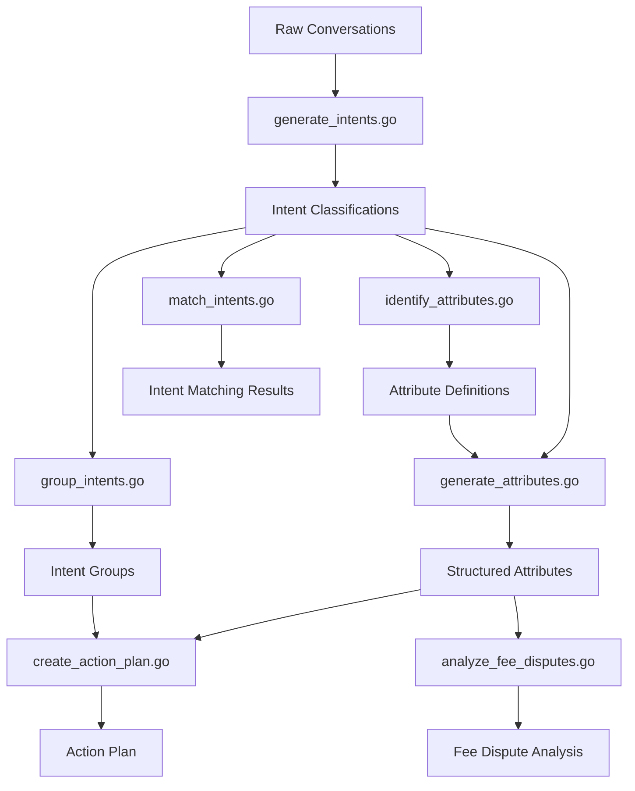

# Conversation Analysis Pipeline Overview

_Last Updated: [Current Date]_
_Version: 1.0.2_

This document explains how the various example scripts work together to form a comprehensive conversation analysis pipeline.

## The Complete Analysis Pipeline

Note: Please open this file in a Markdown viewer that supports Mermaid diagrams to view the pipeline visualization.

## Pipeline Steps

### 1. Intent Generation (generate_intents.go)
- **Input**: Raw conversation texts from database
- **Process**: Analyzes each conversation to determine primary intent
- **Output**: JSON file with conversations and their associated intents
- **Purpose**: Categorize conversations by primary customer intent
- **API Endpoint**: `/api/analysis` with `analysis_type: "intent"`

### 2. Intent Grouping (group_intents.go)
- **Input**: Generated intents from step 1
- **Process**: Groups similar intents to identify patterns
- **Output**: JSON file with intent groups and their related conversations
- **Purpose**: Identify common intent categories and reduce intent fragmentation
- **API Endpoint**: Uses `/api/analysis` with `analysis_type: "patterns"`

### 3. Attribute Identification (identify_attributes.go)
- **Input**: Conversations filtered by specific intents
- **Process**: Analyzes conversations to identify what attributes could be extracted
- **Output**: JSON file with suggested attribute definitions
- **Purpose**: Determine what structured data fields would be useful for further analysis
- **API Endpoint**: `/api/analysis` with `analysis_type: "attributes"` and `parameters: { "generate_required": true }`

### 4. Attribute Generation (generate_attributes.go)
- **Input**: Conversations and attribute definitions
- **Process**: Extracts specific attribute values from conversations
- **Output**: JSON file with conversations and their extracted attributes
- **Purpose**: Create structured data from unstructured conversations
- **API Endpoint**: `/api/analysis` with `analysis_type: "attributes"`

### 5. Intent Matching (match_intents.go)
- **Input**: Generated intents and predefined intent categories
- **Process**: Compares generated intents against expected categories
- **Output**: JSON file with matching results and evaluation metrics
- **Purpose**: Evaluate intent classification accuracy and improve categorization
- **API Endpoint**: `/api/analysis` with `analysis_type: "intent"`

### 6. Fee Dispute Analysis (analyze_fee_disputes.go)
- **Input**: Conversations specifically about fee disputes with generated attributes
- **Process**: Deep analysis of fee dispute patterns, causes, and resolutions
- **Output**: JSON file with analysis results, trends, and insights
- **Purpose**: Gain specific insights into fee dispute conversations
- **API Endpoints**: `/api/analysis` with various analysis types including `"attributes"`, `"trends"`, and `"findings"`

### 7. Action Plan Creation (create_action_plan.go)
- **Input**: Intent groups and structured attributes
- **Process**: Generates actionable recommendations based on conversation analysis
- **Output**: JSON file with prioritized action plan
- **Purpose**: Convert analysis insights into concrete actions
- **API Endpoint**: `/api/analysis` with `analysis_type: "recommendations"` and/or `analysis_type: "plan"`

## API Integration

All scripts communicate with the API server running at http://localhost:8080 and utilize the consolidated standard endpoint:

- `/api/analysis` - Unified endpoint for all analysis types with the following analysis_type values:
  - `"intent"` - For intent classification
  - `"attributes"` - For attribute extraction and identification
  - `"patterns"` - For pattern identification in data
  - `"trends"` - For trend analysis in structured data
  - `"findings"` - For deep analysis of specific insights
  - `"recommendations"` - For generating actionable recommendations
  - `"plan"` - For creating action plans from recommendations

> **Note**: This is an update from the previous version which used separate endpoints for each analysis type. The consolidated `/api/analysis` endpoint provides a more standardized interface while maintaining all existing functionality.

The `ApiClient` class in `utils.go` handles all API communications with retries and error handling.

## Data Flow

The pipeline typically flows in the order above, but each script can also be run independently with appropriate inputs. The workflow ID parameter helps track related analyses across multiple script runs.

### Database → Scripts → JSON Files

1. **Data Source**: SQLite database containing conversation records
2. **Processing**: Each script reads relevant data and processes it through the API
3. **Results Storage**: Analysis results are saved as JSON files
4. **Optional**: Results can be loaded back into the database or other systems

## Use Cases

### Customer Intent Understanding
Use `generate_intents.go` followed by `group_intents.go` to understand what customers are trying to accomplish in their conversations.

### Structured Data Extraction
Use `identify_attributes.go` followed by `generate_attributes.go` to convert unstructured conversation text into structured data fields.

### Quality Evaluation
Use `match_intents.go` to evaluate how well the system is classifying intents compared to expected categories.

### Focused Analysis
Use `analyze_fee_disputes.go` to deeply analyze specific conversation types (in this case, fee disputes).

### Action Planning
Use `create_action_plan.go` to generate prioritized recommendations based on the analysis results.

## Error Handling

Each script in the pipeline includes robust error handling for common scenarios:

1. **API Connection Errors**: Automatic retries with exponential backoff when the API server is unavailable
2. **Data Validation Errors**: Clear error messages when input data doesn't meet expected formats
3. **Rate Limiting**: Respects API rate limits with appropriate pausing
4. **Incomplete Results**: Partial results are saved with warnings when some items fail processing
5. **Database Errors**: Detailed error messages for database connectivity issues

See the `utils.go` file for the common error handling implementation used across all scripts.

## Extending the Pipeline

The pipeline can be extended with additional scripts for:
- Sentiment analysis
- Topic modeling
- Customer satisfaction prediction
- Custom attribute generation
- Conversation clustering

Any new script should follow the pattern of reading input data, processing it through the API, and producing structured output. 

For more complex analysis workflows, consider using the `/api/analysis/chain` endpoint which allows chaining multiple analysis steps in a single request. 